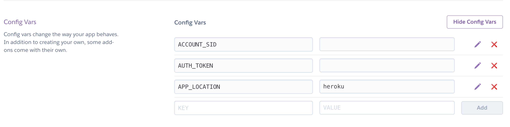
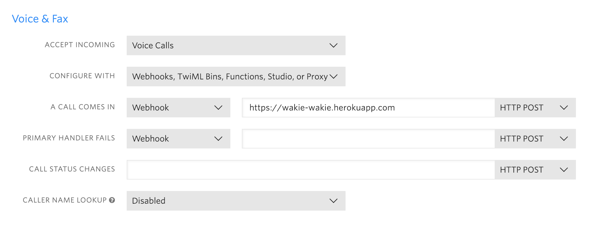

# wakie-wakie

## Requirements
+ Python
+ Bottle
+ Twilio Voice

## Config
1. get a TEST phone number from Twilio
2.   
3. Config TEST number -> `Voice & Fax` -> https://wakie-wakie.herokuapp.com   

## Run
https://wakie-wakie.herokuapp.com/call/<outbound_phone_number>

`<outbound_phone_number>` = 16501234567